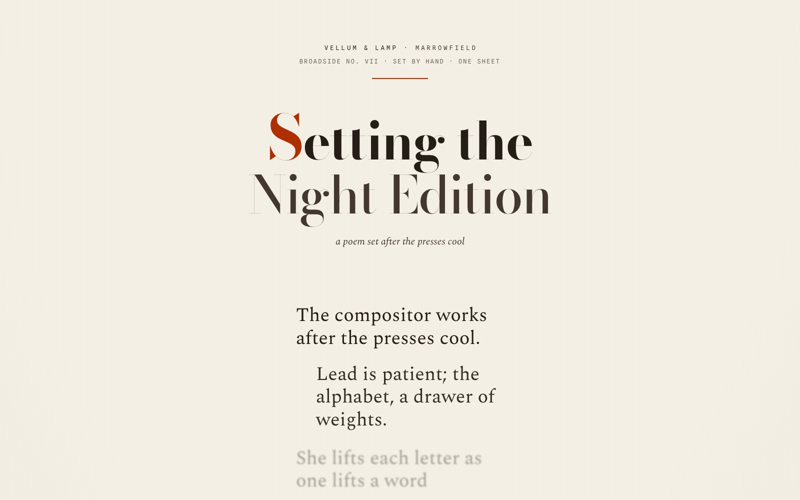
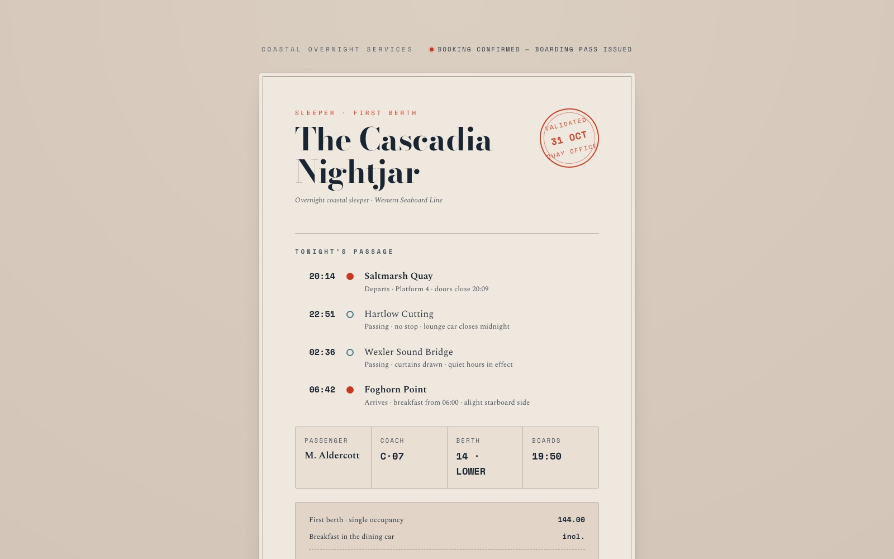
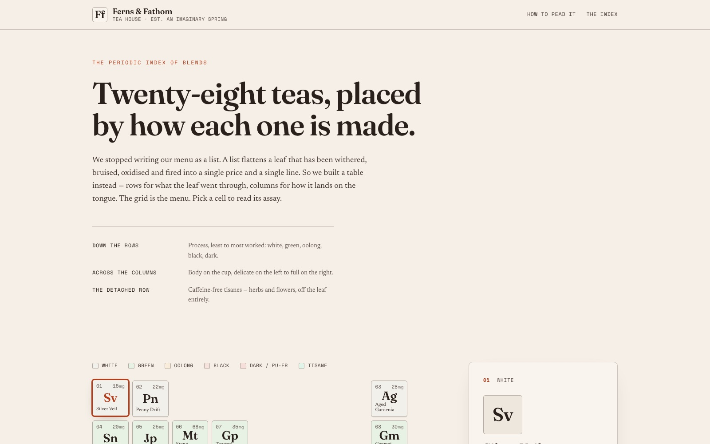
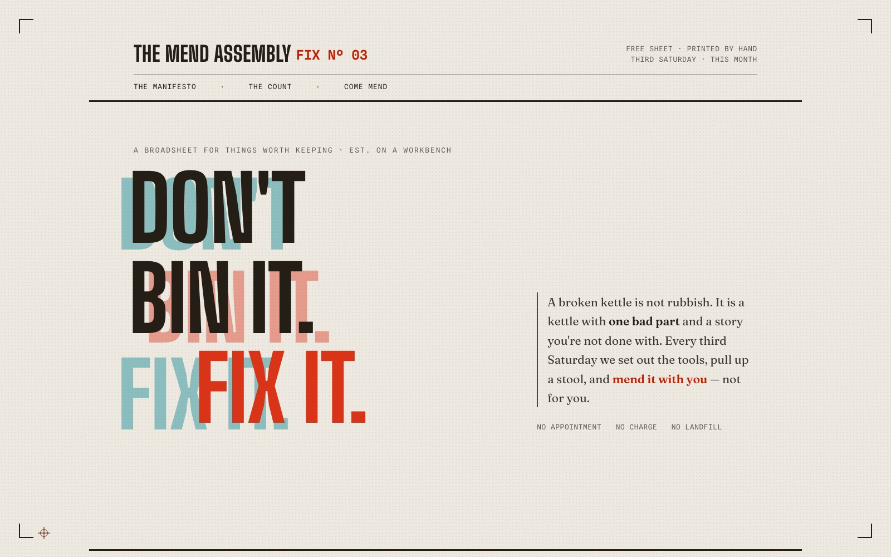

# Hallmark

**A design skill for Claude Code, Cursor, and Codex that refuses to look AI-generated.**

[Live demo →](https://www.usehallmark.com) &nbsp;·&nbsp; twenty themes &nbsp;·&nbsp; four verbs &nbsp;·&nbsp; press `T` to cycle.

Made by Together AI.

<p align="center">
  
</p>

Hallmark picks a macrostructure for the brief, dresses it in one of twenty themes, runs seventy slop-test gates plus a pre-emit self-critique, and refuses the on-distribution defaults every LLM was trained into. Two pages by Hallmark for two different briefs feel like different sites, not colour-swaps of the same template.

---

## Four verbs

| Verb | What it does |
| --- | --- |
| *(default)* | Build new UI. Picks a macrostructure, applies the rule-set, runs the slop test before handing back. |
| `hallmark audit <target>` | Score existing code against the anti-patterns. Punch list, no edits. |
| `hallmark redesign <target>` | Throw out the structure, keep copy + IA + brand, rebuild with a different fingerprint. |
| `hallmark study <screenshot \| URL>` | Extract the **DNA** from a design you admire — macrostructure, type-pairing, colour anchor. Refuses pixel-clones and paid templates. Optionally emits a portable `design.md` for handoff to other AI tools. |

---

## Different briefs, different shapes

Each generated by exercising the skill on a different brief. The skill picks differently every time — no two share a macrostructure or theme.

<table>
  <tr>
    <td width="25%"><a href="https://www.usehallmark.com/examples/tally/"></a></td>
    <td width="25%"><a href="https://www.usehallmark.com/examples/wayfare/"></a></td>
    <td width="25%"><a href="https://www.usehallmark.com/_tests/09-slow-pour/"></a></td>
    <td width="25%"><a href="https://www.usehallmark.com/examples/bananastudio/"></a></td>
  </tr>
  <tr>
    <td><b>Tally</b><br/><sub>SaaS · modern-minimal</sub></td>
    <td><b>Wayfare</b><br/><sub>Travel · atmospheric</sub></td>
    <td><b>Slow Pour</b><br/><sub>Coffee subscription</sub></td>
    <td><b>BananaStudio</b><br/><sub>Studio · playful</sub></td>
  </tr>
  <tr>
    <td><a href="https://www.usehallmark.com/_tests/06-anya-portfolio/"></a></td>
    <td><a href="https://www.usehallmark.com/examples/najm/"></a></td>
    <td><a href="https://www.usehallmark.com/_tests/11-soroe-ceramics/"></a></td>
    <td><a href="https://www.usehallmark.com/examples/hyperlane/"></a></td>
  </tr>
  <tr>
    <td><b>Anya Reis</b><br/><sub>Personal site</sub></td>
    <td><b>NAJM</b><br/><sub>Fashion brand</sub></td>
    <td><b>Søroe</b><br/><sub>Ceramics studio</sub></td>
    <td><b>Hyperlane</b><br/><sub>Dev infrastructure</sub></td>
  </tr>
</table>

Each page is self-contained HTML + CSS, stamped with its macrostructure in the CSS comment. Browse the full set at [usehallmark.com](https://www.usehallmark.com) or under [`site/_tests/`](site/_tests/).

---

## Custom <sup>NEW</sup>

Most briefs route to the catalog. But when a brief carries real creative intent — a named brand colour, a vibe the catalog can't carry, or a layout that *is* the point — Hallmark switches to **Custom** and designs the whole page from first principles: a made-to-measure OKLCH palette, a free-font pairing, and a structure no catalog theme would produce. Same seventy slop-test gates. No template underneath.

Four one-line briefs, four pages that share nothing:

<table>
  <tr>
    <td width="25%"><a href="https://www.usehallmark.com/examples/custom-01/"></a></td>
    <td width="25%"><a href="https://www.usehallmark.com/examples/custom-02/"></a></td>
    <td width="25%"><a href="https://www.usehallmark.com/examples/custom-03/"></a></td>
    <td width="25%"><a href="https://www.usehallmark.com/examples/custom-04/"></a></td>
  </tr>
  <tr>
    <td><b>Setting the Night Edition</b><br/><sub>Letterpress poem broadside</sub></td>
    <td><b>The Cascadia Nightjar</b><br/><sub>Sleeper-train ticket</sub></td>
    <td><b>Ferns &amp; Fathom</b><br/><sub>Tea menu as a periodic table</sub></td>
    <td><b>The Mend Assembly</b><br/><sub>Repair-café manifesto poster</sub></td>
  </tr>
</table>

Custom stays a quiet branch — vanilla briefs never see it. The protocol lives in [`custom-theme.md`](skills/hallmark/references/custom-theme.md).

---

## Install

```
npx skills add nutlope/hallmark
```

Re-run any time to update. Or copy [`SKILL.md`](skills/hallmark/SKILL.md) + [`references/`](skills/hallmark/references/) into:

- **Claude Code** — `~/.claude/skills/hallmark/`
- **Cursor** — `.cursor/rules/hallmark.mdc` (body of `SKILL.md`, no frontmatter)
- **Codex** — `~/.codex/skills/hallmark/` (personal) or `.codex/skills/hallmark/` (project-scoped)

The rule-set lives in [`SKILL.md`](skills/hallmark/SKILL.md) and [`references/`](skills/hallmark/references/). Worked examples in [`docs/recipes.md`](docs/recipes.md) and [`docs/study-examples.md`](docs/study-examples.md).

---

## Licence

MIT. Use it, fork it, ship it.
